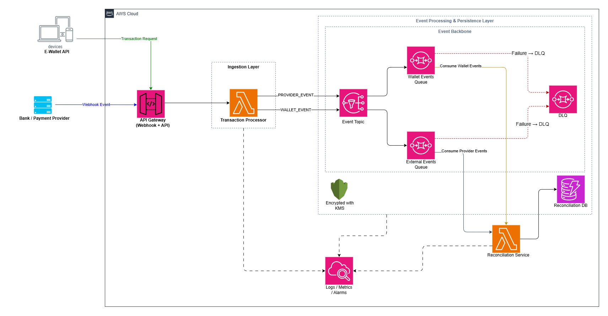

# Event-Driven Reconciliation on AWS (CloudFormation)

This repository contains an AWS CloudFormation template that implements a scalable, serverless, event-driven reconciliation system for processing e-wallet transactions and external payment provider events.

The architecture is designed to decouple transaction ingestion from downstream processing using asynchronous messaging. Incoming requests from client applications and webhook events from payment providers are handled via Amazon API Gateway and processed by AWS Lambda. Events are then published to Amazon SNS and distributed across multiple Amazon SQS queues to enable independent, reliable consumption.

A dedicated reconciliation service processes wallet and provider events, persisting results in Amazon DynamoDB. The system incorporates fault tolerance through Dead Letter Queues (DLQs), encryption using AWS KMS, and observability via Amazon CloudWatch for logging, metrics, and alarms.

This design supports high scalability, resilience, and maintainability, making it suitable for real-time financial transaction processing in distributed systems.
